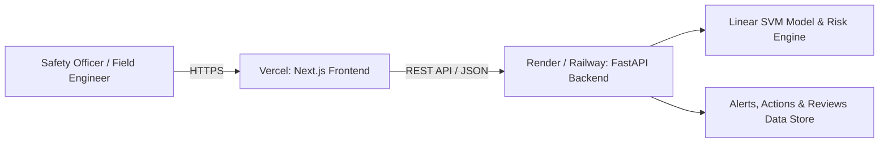

# 🚀 Deployment Guide: Sentinel SafetyAI (SurakshaSetu)

This guide provides step-by-step instructions to deploy the full **Sentinel SafetyAI** platform using the recommended modern stack:
* **Frontend (Next.js 16 App Router)**: Hosted on **Vercel** (Free Tier, Global Edge CDN, Zero Maintenance)
* **Backend (FastAPI + Python ML Service)**: Hosted on **Render** or **Railway** (Free/Hobby Tier, Native Python & Container Support)

---

## 📋 Architecture & Prerequisites



### What You Need:
1. A free [GitHub](https://github.com) account.
2. A free [Vercel](https://vercel.com) account (sign in with GitHub).
3. A free [Render](https://render.com) or [Railway](https://railway.app) account (sign in with GitHub).

---

## 🛠️ Step 1: Push the Code to Your GitHub Repository

If you haven't pushed this project to GitHub yet, run the following commands from your terminal in the project root folder:

```bash
# 1. Initialize git (if not already done)
git init

# 2. Add all files and create an initial commit
git add .
git commit -m "Initial commit: Sentinel SafetyAI platform ready for deployment"

# 3. Create a new repository on GitHub (https://github.com/new)
# Named e.g. "safety-intelligence-platform" (Public or Private)

# 4. Link your remote repository and push to main
git branch -M main
git remote add origin https://github.com/<YOUR_GITHUB_USERNAME>/safety-intelligence-platform.git
git push -u origin main
```

---

## ⚙️ Step 2: Deploy the FastAPI Backend to Render

You have two easy ways to deploy on Render:

### Method A: 1-Click Render Blueprint (Recommended)
This repository contains a preconfigured [render.yaml](file:///c:/Users/rauna/Downloads/safety-intelligence-platform/render.yaml).

1. Log into your [Render Dashboard](https://dashboard.render.com).
2. Click **New +** and select **Blueprint**.
3. Select your GitHub repository (`safety-intelligence-platform`).
4. Render will read `render.yaml` and configure the service automatically.
5. Click **Apply**.
6. Wait 2–3 minutes for dependencies (`scikit-learn`, `fastapi`, `uvicorn`, etc.) to install and the service to launch.

---

### Method B: Manual Web Service Setup on Render
If you prefer setting it up manually in the Render dashboard:

1. Click **New +** > **Web Service**.
2. Connect your GitHub repository.
3. Configure the settings:
   * **Name**: `sentinel-safety-backend`
   * **Region**: Choose closest to you (e.g., *Oregon (US West)* or *Frankfurt (EU)*)
   * **Root Directory**: `backend`
   * **Runtime**: `Python 3`
   * **Build Command**: `pip install -r requirements.txt`
   * **Start Command**: `uvicorn main:app --host 0.0.0.0 --port $PORT`
   * **Plan**: `Free`
4. Expand **Advanced** and add the following **Environment Variables**:
   * `PYTHON_VERSION`: `3.11.9`
   * `HOST`: `0.0.0.0`
   * `CORS_ORIGINS`: `*` *(We will restrict this to your Vercel URL in Step 4)*
5. Click **Create Web Service**.

---

### ✅ Verify Backend Health
Once Render shows **Live**, note your service URL (e.g. `https://sentinel-safety-backend.onrender.com`).
Test it in your browser:
* **Health Check**: `https://sentinel-safety-backend.onrender.com/` → Returns `{"status":"ok", "message":"Sentinel AI Safety Intelligence API is live", ...}`
* **Interactive API Docs**: `https://sentinel-safety-backend.onrender.com/docs` (Swagger UI)

---

## 🌐 Step 3: Deploy the Next.js Frontend to Vercel

1. Log into your [Vercel Dashboard](https://vercel.com).
2. Click **Add New…** > **Project**.
3. Under **Import Git Repository**, find and select `safety-intelligence-platform`.
4. In the configuration screen:
   * **Framework Preset**: `Next.js` (automatically detected)
   * **Root Directory**: `./` (leave default)
   * **Build Command**: `next build` (leave default)
   * **Output Directory**: `.next` (leave default)
5. Expand **Environment Variables**:
   * **Key**: `NEXT_PUBLIC_API_URL`
   * **Value**: Your Render backend URL from Step 2 (e.g., `https://sentinel-safety-backend.onrender.com` without trailing slash)
6. Click **Deploy**.
7. Vercel will build and deploy the application in under a minute.

---

## 🔒 Step 4: Lock Down CORS on the Backend

Now that your frontend has a live production URL (e.g., `https://safety-intelligence-platform.vercel.app`):

1. Go back to your [Render Dashboard](https://dashboard.render.com).
2. Select your `sentinel-safety-backend` service.
3. Navigate to **Environment**.
4. Edit the `CORS_ORIGINS` variable:
   * Change `*` to: `https://<YOUR-APP-NAME>.vercel.app`
5. Click **Save Changes**. Render will automatically redeploy with the updated CORS policy.

---

## 🧪 Step 5: End-to-End Production Verification Checklist

Visit your live Vercel URL and test all key platform workflows:

| Feature | Verification Steps | Expected Result |
| :--- | :--- | :--- |
| **System Health Banner** | Check top header on home dashboard | Green indicator showing API connected |
| **Safety Observation Submission** | Go to `/submit-report`, enter an incident description, optionally attach a photo, and click Submit | Returns predicted Severity (I–V), precursor breakdown, and compound risk score |
| **Human Review Workflow** | Go to `/analysis` as Safety Officer, review a report, and click Accept/Modify/Reject | Review persists, audit timestamp updates, action items sync |
| **Action Tracking** | Verify corrective actions generated from observations | Status can be toggled (In Progress / Completed) |
| **SIF Precursor Alerts** | Check High-Risk Precursor Alerts feed | Critical alerts display with acknowledgment controls |
| **Operational Analytics** | Navigate to `/analytics-dashboard` | Real-time charts render severity distribution, precursor frequency, and holdout model metrics |

---

## 💡 Troubleshooting & Best Practices

### 1. Render Free Tier "Spin-Down" (Cold Start)
* On Render's Free tier, services spin down after 15 minutes of inactivity.
* The first request after inactivity may take ~30–50 seconds while the container boots.
* **Pro-tip**: You can use a free monitoring service like [UptimeRobot](https://uptimerobot.com) to ping `https://<your-backend>.onrender.com/` every 10 minutes to keep the container continuously warm.

### 2. CORS Errors in Browser Console
* If you see `Access to fetch at '...' has been blocked by CORS policy`, verify:
  1. `NEXT_PUBLIC_API_URL` on Vercel contains `https://` and has NO trailing slash (`/`).
  2. `CORS_ORIGINS` on Render includes your exact Vercel URL (e.g. `https://your-frontend.vercel.app`).

### 3. Updating Code Later
* Every time you `git push origin main`:
  * **Vercel** automatically triggers an optimized Next.js build and deploys.
  * **Render** automatically pulls the latest commit, reinstalls dependencies if needed, and redeploys the backend.
